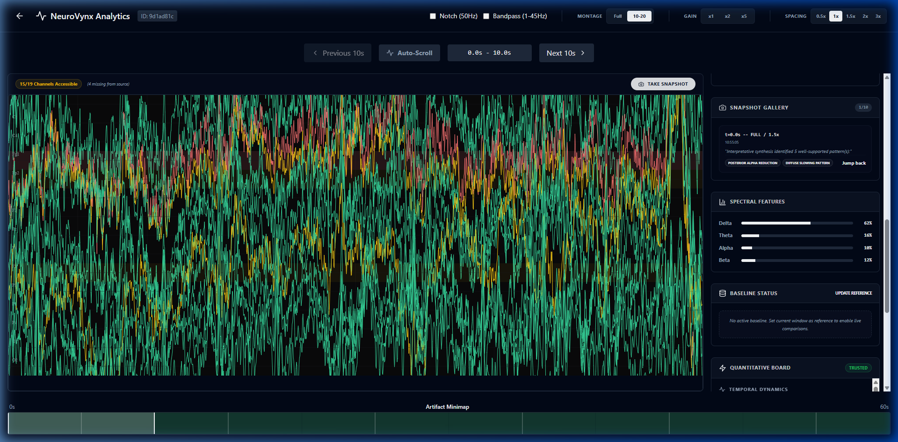
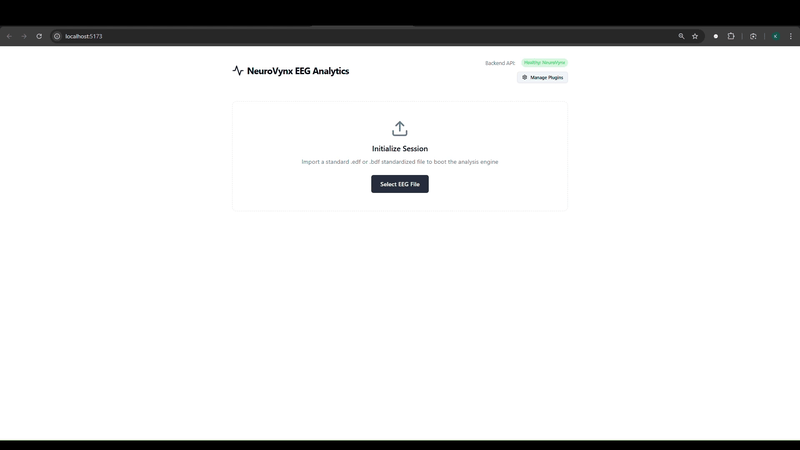
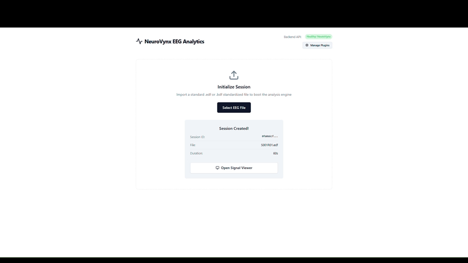

### Trust-aware EEG and comparative qEEG research framework

[](https://doi.org/10.5281/zenodo.19563589)

NeuroVynx is a research-focused EEG and qEEG analysis framework designed for transparent, trust-aware interpretation. It integrates signal quality analysis, quantitative metrics, spatial topography, and reference-based comparison into a modular end-to-end pipeline. Built for researchers and developers, NeuroVynx emphasizes strict interpretive boundaries and non-diagnostic reporting, ensuring that all downstream analysis and interpretation are gated by signal integrity.

The framework is designed to support reproducible EEG analysis workflows while maintaining strict methodological boundaries. It is intended as a foundation for further research development and extension across EEG and qEEG workflows.

---

## Key Features

- **Signal Quality Engine**: Heuristic-based trust scoring and artifact detection.
- **Plugin-Ready Architecture**: Modular extension layer for custom analytics and visualization.
- **Interpretive Intelligence**: Hardened, confidence-aware narratives that manage data state transparently.
- **qEEG Metrics**: Relative and absolute power analysis across standard frequency bands.
- **Spatial Topography**: High-performance scalp-level interpolation.
- **Normative Comparison**: Z-score deviation mapping relative to reference datasets.
- **Trust-Aware Gating**: Automated analysis withholding for low-quality signal segments.
- **High-Performance UI**: Electron-based React frontend with hardware-accelerated Canvas rendering.

## Platform Capabilities

<div align="center">
  
  <p><em>Comprehensive Researcher Dashboard: EEG waveforms, Quantitative Board, and Interpretive Insights.</em></p>
</div>

### I. Data Ingestion & Session Management
High-speed data ingestion supporting standard EDF formats with automated session initialization and database persistence.

<div align="center">
   &nbsp;
  
</div>

### II. Signal Integrity & Researcher Controls
Hardware-accelerated EEG visualization with integrated artifacts minimaps, Notch filters, and Bandpass controls to ensure signal trust.

<div align="center">
   &nbsp;
  
</div>

### III. Quantitative Analysis & Interpretation
Live spatial topography mapping (absolute/relative/Z-score) paired with an automated interpretive engine for cross-referenced insights.

<div align="center">
   &nbsp;
  
</div>

### IV. Extensibility & Plugin Architecture
A modular plugin manager and developer SDK for rapid implementation of custom signal processing and visualization modules.

<div align="center">
   &nbsp;
  
</div>

## Why NeuroVynx?

Many EEG tools visualize data without sufficient attention to signal trust, quality thresholds, and interpretive boundaries. NeuroVynx aims to bridge this gap by making EEG/qEEG analysis more transparent, modular, and reproducible. It prioritizes "trust before interpretation," ensuring that users understand signal reliability before interpreting comparative results.

## Current Scope

- **Research-Focused**: Designed for exploratory analysis and method development.
- **Reference-Based**: Outputs are descriptive deviations relative to internal or provided reference groups.
- **Non-Diagnostic**: Not intended for clinical diagnosis, patient management, or medical decision support.
- **Supported Workflows**: Currently optimized for descriptive and comparative qEEG research tasks.

## Quick Start

### 1. Prerequisites
- Python 3.9+
- Node.js 18+

### 2. Installation
```bash
# Clone the repository
git clone https://github.com/OrganicArchive/NeuroVynx.git
cd NeuroVynx

# Install dependencies and bootstrap
make install-backend
make install-frontend
make bootstrap
```

### 3. Launch
```bash
make dev
```

## Repository Structure

- `backend/`: FastAPI DSP engine and signal processing pipeline.
- `frontend/`: React/Electron visualization interface.
- `docs/`: Comprehensive project documentation and safety guidelines.
- `data/`: Storage for internal normative reference models and sample data.
- `tests/`: System and unit testing suites.
- `examples/`: Guided workflows and implementation demonstrations.

---

> [!CAUTION]
> **Safety Note: Non-Diagnostic Use Only**
> NeuroVynx is a research framework, not a medical device. It is not validated for clinical decision-making, disease classification, or treatment recommendation. All outputs are reference-based and descriptive.

---

## Roadmap Snapshot

- **Current milestone**: Stable normative topography and quality engine isolation.
- **Next milestone**: Connectivity metrics (coherence / PLV) and richer normative datasets.
- **Future features**: Longitudinal subject tracking and automated research report generation.

## Citation

If you use NeuroVynx in research, teaching, or derivative work, please cite or acknowledge the repository:

**Bakker, K. (2026). NeuroVynx: Trust-aware EEG and comparative qEEG research framework.**  
Available at: https://doi.org/10.5281/zenodo.19563589

---
*Built by Kai Bakker | NeuroVynx Research Project*
