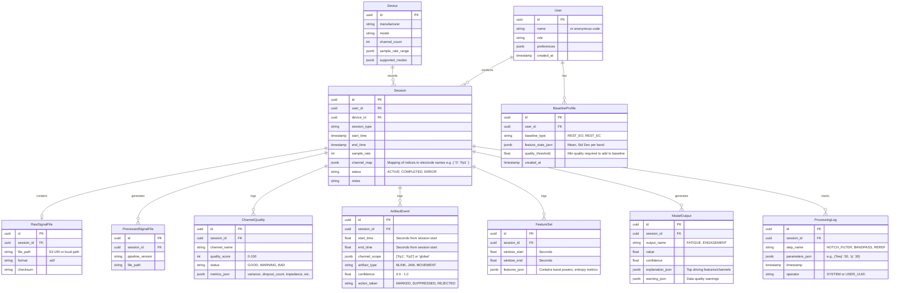

# Database Schema

The MVP uses PostgreSQL. For file storage (Raw EDF and Processed binaries), we store pointers (`file_path`) and metadata in the database.

## Schema Overview

```mermaid
erDiagram
    User ||--o{ Session : conducts
    User ||--o{ BaselineProfile : has
    Device ||--o{ Session : records
    Session ||--o| RawSignalFile : contains
    Session ||--o{ ProcessedSignalFile : generates
    Session ||--o{ ChannelQuality : logs
    Session ||--o{ ArtifactEvent : logs
    Session ||--o{ FeatureSet : logs
    Session ||--o{ ModelOutput : generates
    Session ||--o{ ProcessingLog : tracks

    User {
        uuid id PK
        string name "or anonymous code"
        string role
        jsonb preferences
        timestamp created_at
    }

    Device {
        uuid id PK
        string manufacturer
        string model
        int channel_count
        jsonb sample_rate_range
        jsonb supported_modes
    }

    Session {
        uuid id PK
        uuid user_id FK
        uuid device_id FK
        string session_type
        timestamp start_time
        timestamp end_time
        int sample_rate
        jsonb channel_map "Mapping of indices to electrode names e.g. { '0': 'Fp1' }"
        string status "ACTIVE, COMPLETED, ERROR"
        string notes
    }

    RawSignalFile {
        uuid id PK
        uuid session_id FK
        string file_path "S3 URI or local path"
        string format ".edf"
        string checksum
    }

    ProcessedSignalFile {
        uuid id PK
        uuid session_id FK
        string pipeline_version
        string file_path
    }

    ChannelQuality {
        uuid id PK
        uuid session_id FK
        string channel_name
        int quality_score "0-100"
        string status "GOOD, WARNING, BAD"
        jsonb metrics_json "variance, dropout_count, impedance, etc."
    }

    ArtifactEvent {
        uuid id PK
        uuid session_id FK
        float start_time "Seconds from session start"
        float end_time "Seconds from session start"
        jsonb channel_scope "['Fp1', 'Fp2'] or 'global'"
        string artifact_type "BLINK, JAW, MOVEMENT"
        float confidence "0.0 - 1.0"
        string action_taken "MARKED, SUPPRESSED, REJECTED"
    }

    FeatureSet {
        uuid id PK
        uuid session_id FK
        float window_start "Seconds"
        float window_end "Seconds"
        jsonb features_json "Contains band powers, entropy metrics"
    }

    BaselineProfile {
        uuid id PK
        uuid user_id FK
        string baseline_type "REST_EO, REST_EC"
        jsonb feature_stats_json "Mean, Std Dev per band"
        float quality_threshold "Min quality required to add to baseline"
        timestamp created_at
    }

    ModelOutput {
        uuid id PK
        uuid session_id FK
        string output_name "FATIGUE, ENGAGEMENT"
        float value
        float confidence
        jsonb explanation_json "Top driving features/channels"
        jsonb warning_json "Data quality warnings"
    }

    ProcessingLog {
        uuid id PK
        uuid session_id FK
        string step_name "NOTCH_FILTER, BANDPASS, REREF"
        jsonb parameters_json "e.g., {'freq': 50, 'q': 30}"
        timestamp timestamp
        string operator "SYSTEM or USER_UUID"
    }
```
